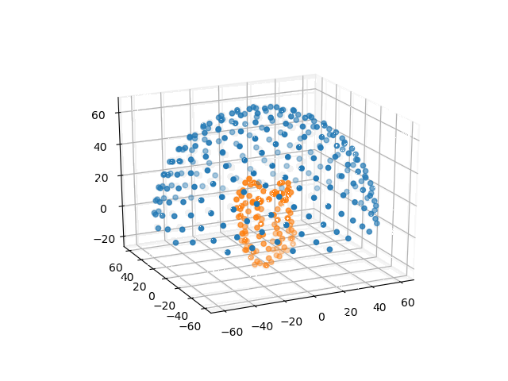

# Transmembrane Protein Area

Tool written in Python3 to identify the place of the membranes of a transmembrane protein from its PDB structural file.
The calculations are only based on geometry and residues hydrophobicity.

This program was done for a university project, based on the following paper :

> [Reference](https://www.ncbi.nlm.nih.gov/pubmed/15180935) :
Tusnády GE, Dosztányi Z, Simon I. Transmembrane proteins in the Protein
Data Bank: identification and classification. Bioinformatics. 2004 Nov
22;20(17):2964-72. Epub 2004 Jun 4. PubMed PMID: 15180935.

## Requirements

* PyMol

      $ sudo apt-get install pymol

* Naccess

	This program is used to calculate the  solvent accessible surface of the residues in the protein. It is downloadable from this site:
	> http://wolf.bms.umist.ac.uk/naccess/
	> The archive is crypted, you should ask for the password by mail and do some paper work.
	> The README specifies a known issue during compilation, follow the instructions to fix it.

* Sphinx (if you want to rebuild the doc only)

	Follow the installation instructions [here](http://www.sphinx-doc.org/en/master/usage/installation.html)
	And the usage [here](http://www.sphinx-doc.org/en/master/usage/quickstart.html)

Install the few required packages / modules:

    $ pip install -r src/requirements.txt

## Run

Run the program:

    $ python main.py -h | --help

It will show the following usage message:

    Usage:
        main.py FILE [--naccess PATH] [--points NUM]

    Options:
        -h, --help                  Show this
        -n PATH, --naccess PATH     Absolute path to local naccess binary
        -p NUM, --points NUM        Number of points to generate on the hemisphere to criss-cross the protein.
                                        A high number will give better results, but longer calculations. [default: 250]

## Example usage

    $ python main.py data/1uaz.pdb

You can specify the resolution by choosing a higher number of points (default 250). The points are evenly distributed on the surface of an hemisphere that englobes the protein, forming as many lines passing by the center of mass of the protein and criss-crossing the protein. The more points the higher the resolution, but the longer the calculations:

    ./main.py data/1uaz_tm.pdb --points 1000 && pymol src/pymol_visualize.pml

If you have problems with Naccess, you can specify the absolute path to the binary of naccess:

    ./main.py data/1uaz_tm.pdb --points 500 --naccess /absolute/path/to/naccess/binary && pymol src/pymol_visualize.pml

The progam generates a _.pml_ file (PyMol file) containing commands to visualize the "best" line. This line is normal to the membranes.

## Runtime

The program prints in the terminal the total runtime. The following run:

    ./main.py data/1uaz_tm.pdb --points 1000 && pymol src/pymol_visualize.pml

Generates the following output in the terminal:

    Best line:
        Point of the sphere:  [6.2083, 3.9456, 69.5865]
        Hydrophobicity: 476.4018

    Center of mass:  [0.2990, -0.3941, -0.0285]

    Program runtime:  0:00:00.552432

And opens a PyMol vue of the protein with
